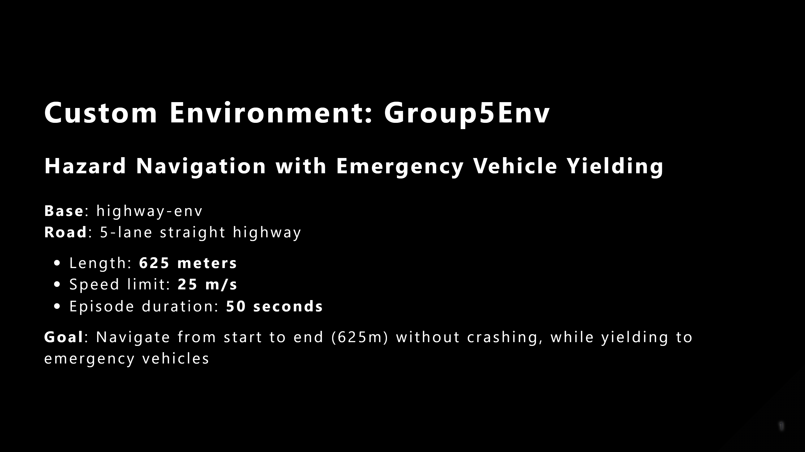
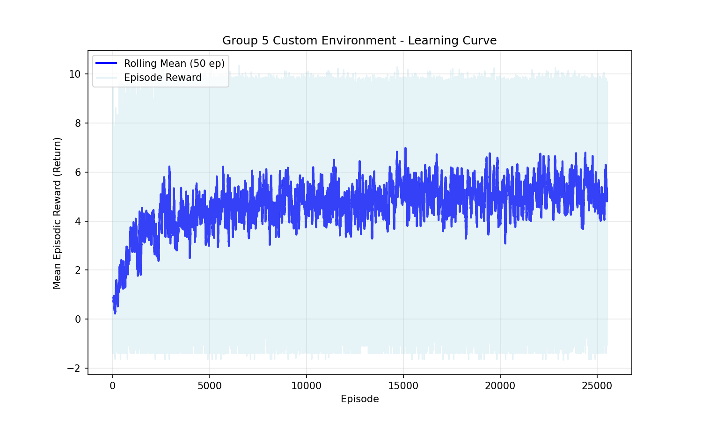
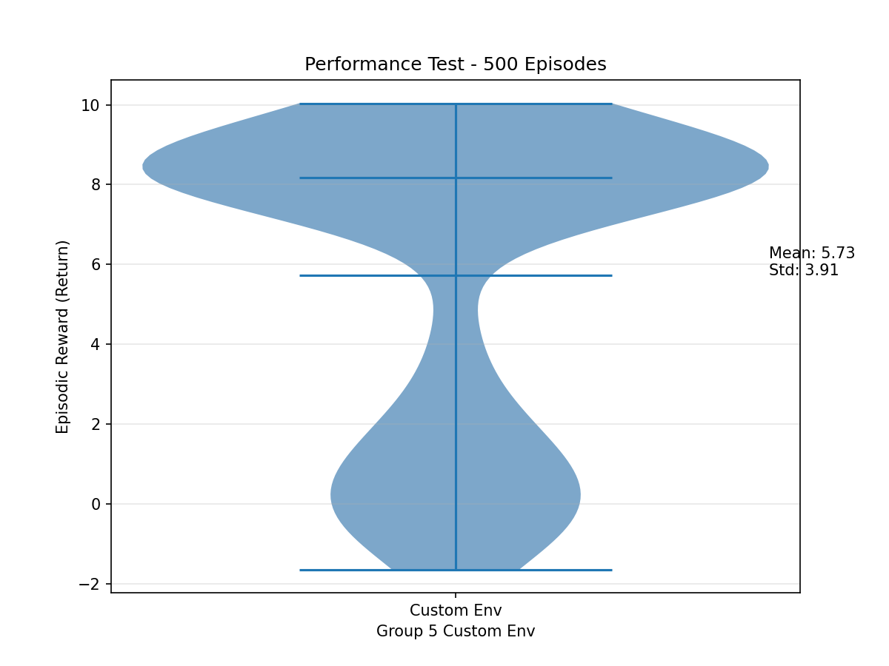

# Custom Highway Environment

A custom `highway-env` driving task with lane closures, stalled vehicles, emergency vehicles, and yielding traffic behavior. The repo also includes PPO training and evaluation code for the custom environment.

## Overview

`CustomHighwayEnv` extends `highway-env` with a longer five-lane road and randomized hazards. The ego vehicle must reach the end of the road while avoiding blocked lanes, stopped vehicles, traffic, and faster emergency vehicles.

The environment is registered as:

```python
custom-highway-env-v0
```

## Environment design

| Component | Description |
|---|---|
| Road | Five-lane straight highway, 625 meters long. |
| Lane closure | A 40-meter obstacle placed in a random middle lane. |
| Stalled vehicle | A stopped vehicle placed before or after the closure in a different lane. |
| Emergency vehicle | A faster purple vehicle that can appear during an episode. |
| Traffic | IDM/MOBIL traffic vehicles with yielding behavior near emergency vehicles. |
| Observation | `LidarObservation` with 128 cells and 120-meter range. |
| Action space | `DiscreteMetaAction`, matching the standard `highway-env` high-level actions. |



## Reward design

The reward combines progress, speed, lane changes, collision avoidance, successful completion, and emergency-vehicle yielding.

| Reward term | Weight | Purpose |
|---|---:|---|
| Collision | -1.5 | Penalizes crashes. |
| Speed | 0.3 | Rewards driving in the target speed range. |
| Progress | 0.4 | Rewards forward movement along the road. |
| Success | 1.0 | Rewards reaching the end without crashing. |
| Lane change | -0.01 | Discourages unnecessary lane changes. |
| Yielding | 0.5 | Rewards not blocking nearby emergency vehicles. |

## Results

The included PPO agent was trained for 300,000 timesteps and evaluated over 500 deterministic episodes.

| ID | Environment | Result | File |
|---|---|---|---|
| 13 | Custom highway environment | Learning curve | `results/plots/ID13_Custom_Env_Learning_Curve.png` |
| 14 | Custom highway environment | Performance test | `results/plots/ID14_Custom_Env_Performance_Test.png` |





## Repository structure

```text
custom-highway-env/
├── README.md
├── requirements.txt
├── src/
│   ├── custom_highway_env.py
│   ├── train_custom_ppo.py
│   └── evaluate_custom_ppo.py
├── results/
│   ├── README.md
│   └── plots/
├── models/
│   ├── README.md
│   └── ID13_Custom_Env_Trained_Model.zip
├── assets/
│   └── custom_environment_overview.png
└── docs/
    └── environment_design.md
```

## Key files

- `src/custom_highway_env.py`: Defines `CustomHighwayEnv`, custom vehicles, hazards, reward terms, termination logic, and Gymnasium registration.
- `src/train_custom_ppo.py`: Trains a PPO agent and saves the ID 13 learning curve.
- `src/evaluate_custom_ppo.py`: Loads the trained PPO agent and runs the ID 14 performance test.
- `docs/environment_design.md`: Describes the environment mechanics and reward function.
- `results/README.md`: Indexes the included result artifacts.
- `models/README.md`: Documents the included trained checkpoint.

## Setup

```bash
python -m venv .venv
.venv\Scripts\activate
pip install -r requirements.txt
```

## Quick environment check

```bash
python -c "import sys, gymnasium as gym; sys.path.insert(0, 'src'); from custom_highway_env import register_custom_env; register_custom_env(); env = gym.make('custom-highway-env-v0'); obs, info = env.reset(); print(obs.shape, env.action_space); env.close()"
```

Expected output shape:

```text
(128, 2) Discrete(5)
```

## Training

```bash
python src/train_custom_ppo.py
```

The default training run uses 300,000 timesteps. For a short smoke test:

```powershell
$env:TOTAL_TIMESTEPS=1000
python src/train_custom_ppo.py
```

## Evaluation

```bash
python src/evaluate_custom_ppo.py
```

The default evaluation uses 500 deterministic episodes. For a short smoke test:

```powershell
$env:EVAL_EPISODES=10
python src/evaluate_custom_ppo.py
```

## Model checkpoint

The included checkpoint is stored at:

```text
models/ID13_Custom_Env_Trained_Model.zip
```

It can be loaded with Stable-Baselines3:

```python
from stable_baselines3 import PPO

model = PPO.load("models/ID13_Custom_Env_Trained_Model.zip")
```
